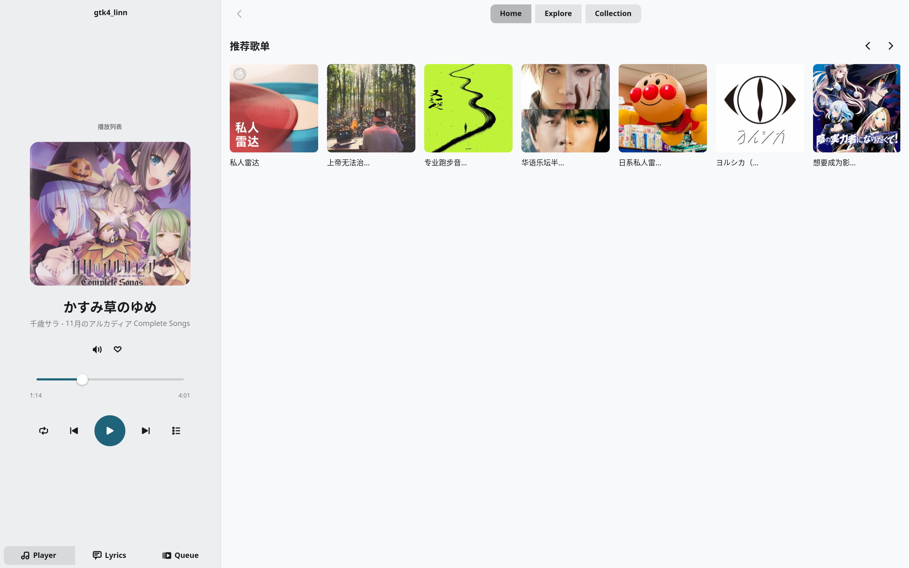
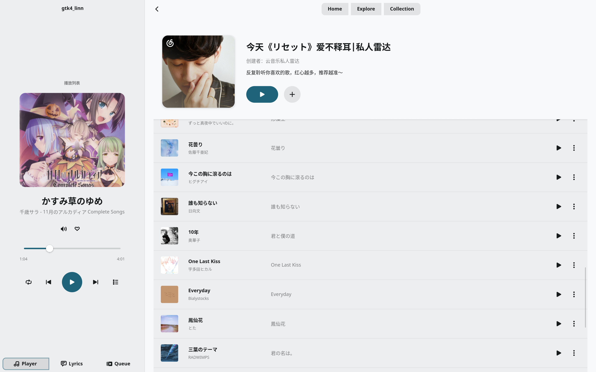
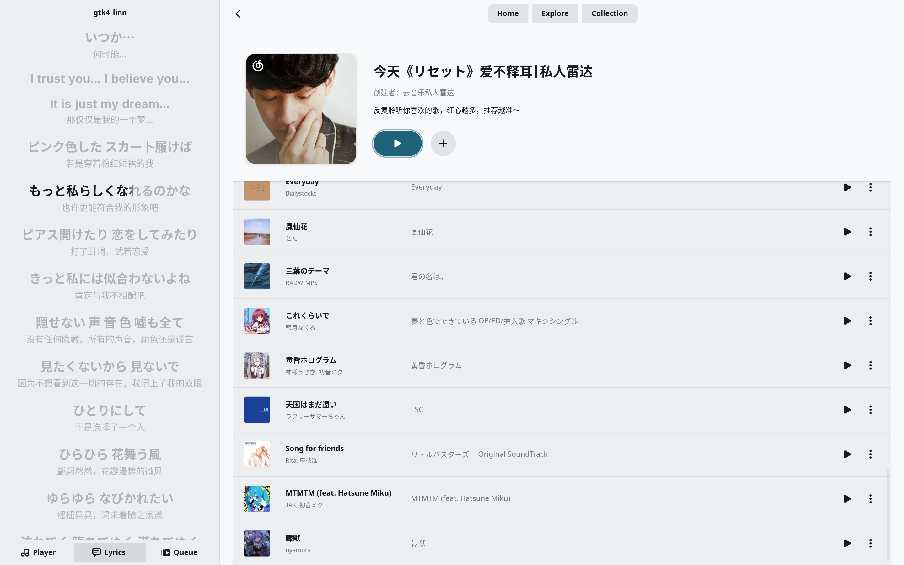

# Linn

🎵 一个使用 Rust + GTK4 构建的现代某云音乐第三方桌面客户端

> ✨ 纯原生 Rust 应用，无 WebView，面向高性能与可扩展架构设计

---

## ✨ 项目特点

* **原生性能**
  基于 Rust + GTK4，无 Electron/WebView，低内存占用与高响应速度

* **现代 GNOME 风格 UI**
  使用 libadwaita，遵循 GNOME HIG 设计规范

* **声明式架构**
  基于 Relm4，组件化 UI + 消息驱动更新

* **完整播放系统**
  GStreamer 驱动音频播放 + 状态管理

* **MPRIS 集成**
  支持系统媒体控制、锁屏显示、快捷键控制

* **歌词系统（核心特性）**

  * 支持 LRC（逐行歌词）
  * 支持 YRC（逐字歌词 / 卡拉OK级别）
  * 容错解析（适配用户上传的脏数据）
  * 为后续动画/高亮渲染提供时间轴支持

* **模块化架构**
  UI / 播放器 / API / 工具层完全解耦

---

## 🧱 技术栈

| 组件     | 技术                  |
| ------ | ------------------- |
| 语言     | Rust (2024 Edition) |
| UI     | GTK4 + libadwaita   |
| GUI 架构 | Relm4               |
| 播放引擎   | GStreamer           |
| 异步运行时  | Tokio               |
| API    | 网易云音乐 API           |
| 媒体协议   | MPRIS (D-Bus)       |
| 缓存     | Moka                |

---

## 🚀 已实现功能

### 🖥️ 用户界面

* 侧边栏布局（OverlaySplitView）
* 路由系统（页面切换）
* 首页推荐歌单
* 歌单详情页
* 图片异步加载 + 缓存
* 页面动画过渡

---

### 🎧 播放系统

* 播放 / 暂停 / 上一首 / 下一首
* GStreamer 音频后端
* 播放状态同步
* MPRIS 桌面集成

---

### 🌐 网络与数据

* 网易云 API 集成
* 歌单 / 歌曲数据获取
* 播放地址解析
* Cookie 登录支持

---

### 🎤 歌词系统（重点）

* LRC 解析（逐行）
* YRC 解析（逐字）
* 时间戳容错处理（如 `00:00:123`）
* 自动过滤无效/空行
* 为逐字高亮 / 动画提供数据结构支持

---

## 📂 项目架构

```
src
├── api/                # API 层（网络请求 + 数据模型）
│   ├── client.rs
│   └── model.rs
│
├── player/             # 播放核心
│   ├── engine.rs       # 播放引擎（GStreamer）
│   ├── player.rs       # 播放状态管理
│   ├── queue.rs        # 播放队列
│   ├── mpris.rs        # MPRIS 集成
│   ├── facade.rs       # 对外统一接口
│   └── messages.rs     # 播放消息
│
├── ui/                 # UI 层（Relm4 组件）
│   ├── window.rs       # 主窗口
│   ├── route.rs        # 路由系统
│   ├── home.rs
│   ├── explore.rs
│   ├── player.rs
│   ├── lyric.rs        # 歌词页面
│   ├── components/     # UI 组件
│   │   ├── lyric_widget.rs
│   │   ├── playlist_card.rs
│   │   └── image/
│   │
│   └── model/          # UI 数据模型
│       └── lyric.rs
│
└── utils/              # 工具层
    ├── lyric_parse.rs  # 歌词解析（LRC/YRC）
    └── utils.rs
```

---

## 🛠️ 构建与运行

### Debian / Ubuntu

```bash
sudo apt install \
  libgtk-4-dev \
  libadwaita-1-dev \
  libgstreamer1.0-dev \
  gstreamer1.0-plugins-base \
  gstreamer1.0-plugins-good
```

---

### Arch Linux

```bash
sudo pacman -S \
  gtk4 \
  libadwaita \
  gstreamer \
  gst-plugins-base \
  gst-plugins-good
```

---

### 运行

```bash
cargo run
```

---

## 📸 截图





---

## 📌 开发状态

项目处于持续开发中：

* ✅ 核心架构完成
* ✅ 播放系统稳定
* ✅ 歌词解析完成
* 🚧 歌词动画 / 高亮渲染开发中
* 🚧 更多页面与功能持续完善

---

## 📄 License

MIT License
